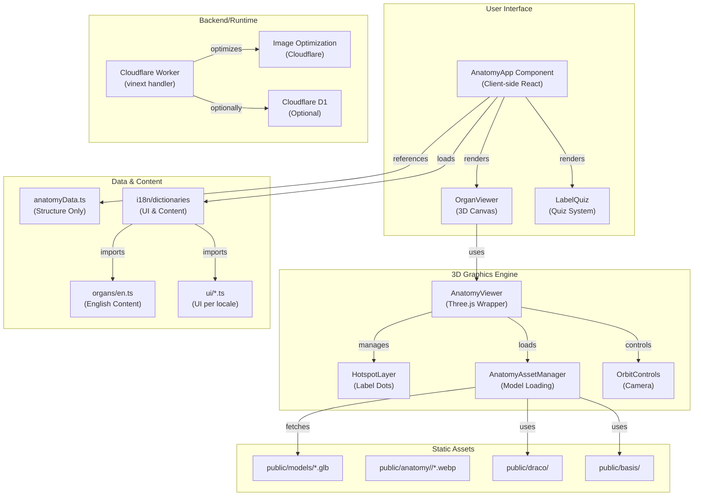

# Inside Human

An interactive, multilingual, medically accurate 3D anatomy learning platform. Explore detailed anatomical structures through immersive 3D visualization, interactive quizzes, comparative analysis, and beautiful medical illustrations.

**Live**: https://insidehuman.app

## Overview

**Inside Human** is an elegant, interactive educational application designed to teach anatomy through immersive 3D visualization. The platform offers detailed, medically accurate 3D models of 9 major human organs, supporting 12 languages with culturally appropriate imagery, terminology, and text directionality.

The application combines cutting-edge web 3D graphics (Three.js) with a sophisticated learning interface, enabling users to explore anatomical structures interactively, take self-assessment quizzes, compare organs to understand their relationships, and access rich educational content about form, function, and clinical significance.

### Core Features

1. **Interactive 3D Organ Viewer**
   - Smooth rotation, zoom, and pan controls
   - Real-time hotspot rendering with depth-based occlusion
   - Auto-rotation with user interaction damping
   - Cross-section (clipping plane) visualization
   - Layer isolation for studying specific structures
   - Responsive performance on desktop and mobile devices

2. **Labeling Quiz System**
   - Fisher-Yates shuffled question order per organ
   - Real-time feedback with visual indicators (correct/incorrect)
   - Progress tracking with visual pip indicators
   - Score reporting and retry functionality
   - Accessible keyboard and screen reader support

3. **Organ Comparison Tool**
   - Side-by-side visualization of two organs at different scales
   - Detailed comparative analysis of function, form, and role
   - Shared hotspot labels across organisms for learning relationships

4. **Comprehensive Educational Content**
   - Detailed anatomical descriptions
   - Daily facts and clinical significance
   - Common conditions and disorders
   - Blood supply information
   - Tissue type classification
   - Poetic, accessible language alongside medical terminology

5. **Multilingual Support (12 Languages)**
   - English, Spanish, Hindi, Chinese, Arabic, Portuguese, French, German, Japanese, Russian, Indonesian, Korean
   - Full i18n for UI, organ data, hotspot labels
   - Proper text directionality (LTR and RTL support)
   - Localized OpenGraph tags and metadata
   - Culture-specific font families and script handling

6. **Advanced 3D Graphics**
   - WebGL rendering with optimized performance
   - Physically-based tone mapping (ACES Filmic)
   - Adaptive pixel density based on device capability
   - Baked contact shadows for depth perception
   - Ambient and directional lighting
   - Texture anisotropy for crisp edge detail
   - Meshopt codec support for compressed model delivery

7. **Accessibility Features**
   - ARIA labels and semantic HTML
   - Keyboard navigation (arrow keys for rotation, +/- for zoom, Escape to close)
   - Live region announcements for quiz feedback
   - Focus management and visual focus indicators
   - Color contrast compliance
   - Fallback glyphs for non-illustrated organs

8. **Learning Resources**
   - Lesson modals with system context
   - Animation hints for functional understanding
   - Medical importance callouts
   - Clinical notes linking anatomy to real-world health

## Technology Stack

### Frontend
- **Framework**: Next.js 16.2 (App Router with React Server Components)
- **UI Library**: React 19 (Latest React with optimized hooks)
- **3D Graphics**: Three.js 0.185 (WebGL rendering engine)
- **3D Controls**: Three.js OrbitControls (camera manipulation)
- **Animation Engine**: GSAP 3.15 (JavaScript animation)
- **Icons**: Lucide React 1.28 (SVG icon library)
- **Styling**: Tailwind CSS 4.2.1 + PostCSS 4.2.1
- **Language**: TypeScript 5.9
- **Asset Loading**: GLTFLoader + Meshopt Decoder (for .glb models)

### Backend / Runtime
- **Platform**: Cloudflare Workers (via vinext)
- **Framework**: vinext 0.0.50 (Next.js on Cloudflare)
- **Build Tool**: Vite 8.0.13
- **Image Optimization**: Cloudflare Workers built-in optimization
- **Worker Bundler**: Wrangler 4.92

### Database / Data Persistence (Optional)
- **ORM**: Drizzle ORM 0.45.2
- **Database**: Cloudflare D1 (SQLite-compatible)
- **Migrations**: Drizzle Kit 0.31.10
- **Migration Target**: SQLite (local development and remote D1)

### Authentication (Optional)
- **Sign-In Method**: Standard Session / OAuth Authentication
- **Implementation**: Server-side header injection from Edge Middleware
- **Headers Used**:
  - `x-authenticated-user-email` - User's email address
  - `x-authenticated-user-full-name` - Full name (if available, percent-encoded UTF-8)
  - `x-authenticated-user-full-name-encoding` - Encoding scheme ("percent-encoded-utf-8")

### Development & Build Tools
- **Package Manager**: npm (Node.js >=22.13.0)
- **Linter**: ESLint 9.39.4 (Next.js + TypeScript configs)
- **Testing**: Node.js native test runner
- **Code Quality**: TypeScript strict mode

## Project Architecture



### Request Flow

```
User Browser
    ↓
Cloudflare Edge (Wrangler)
    ↓
Worker (vinext handler)
    ├→ Next.js App Router
    │  ├→ [locale]/layout.tsx (Server)
    │  └→ [locale]/page.tsx (Server)
    │     └→ <AnatomyApp> (Client)
    │        ├→ Fetch i18n data (getDictionary)
    │        └→ Render UI & 3D viewer
    ├→ Image Optimization (_vinext/image)
    └→ Static Assets (public/*)
```

## Project Structure

```
InsideHuman/
├── app/                              # Next.js App Router source
│   ├── [locale]/                     # Dynamic language routing
│   │   ├── layout.tsx                # Root layout (metadata, OpenGraph, fonts)
│   │   └── page.tsx                  # Home page (serves AnatomyApp)
│   ├── components/
│   │   ├── AnatomyApp.tsx            # Main application UI (state management, modal logic)
│   │   └── OrganViewer.tsx           # 3D viewer wrapper + quiz integration
│   ├── lib/
│   │   ├── anatomy-data.ts           # Organ structure definitions (no translation)
│   │   └── three/
│   │       ├── viewer.ts             # AnatomyViewer class (main 3D engine)
│   │       ├── hotspots.ts           # HotspotLayer (3D label dots)
│   │       ├── loaders.ts            # AnatomyAssetManager (model/texture loading)
│   │       ├── tsl-materials.ts      # Three.js Shading Language nodes
│   │       └── dispose.ts            # WebGL resource cleanup
│   ├── i18n/                         # Internationalization
│   │   ├── config.ts                 # Locale configuration (12 languages, metadata)
│   │   ├── types.ts                  # TypeScript types (OrganContent, UiDictionary)
│   │   ├── dictionaries.ts           # Dynamic i18n loader (per-locale chunks)
│   │   ├── merge.ts                  # Merge structure + prose into Organ type
│   │   ├── fonts.ts                  # Font selection per script group
│   │   ├── organs/
│   │   │   ├── en.ts                 # Organ content (English)
│   │   │   ├── es.ts, hi.ts, zh.ts, ar.ts, pt.ts, fr.ts, de.ts, ja.ts, ru.ts, id.ts, ko.ts
│   │   └── ui/
│   │       ├── en.ts                 # UI strings (English)
│   │       ├── es.ts, hi.ts, ... (same 12 locales)
│   ├── auth.ts               # User OAuth helpers (optional)
│   ├── globals.css                   # Global styles, CSS variables, Tailwind
│   └── .env.local (not in repo)      # Local development environment variables
│
├── db/                               # Database (optional Drizzle + D1)
│   ├── schema.ts                     # Database schema (empty by default)
│   └── index.ts                      # Database accessor with D1 binding
│
├── drizzle/                          # Generated migrations (auto-created)
│   └── meta/_journal.json
│
├── worker/                           # Cloudflare Worker entry point
│   └── index.ts                      # vinext handler + image optimization
│
├── public/                           # Static assets served directly
│   ├── anatomy/                      # Organ illustrations (locale-independent)
│   │   ├── heart/, brain/, lungs/, liver/, kidneys/, eyeball/, intestine/, pancreas/, skin/
│   │   │   ├── thumb.webp            # Small preview (280px)
│   │   │   ├── organ.webp            # Full illustration (700px)
│   │   │   ├── microscopic.webp      # Tissue closeup
│   │   │   ├── compare.webp          # Side-by-side comparison
│   │   │   └── location.webp         # Body location diagram
│   ├── models/                       # 3D mesh models (GLB format)
│   │   ├── heart.glb, brain.glb, lungs.glb, liver.glb, kidneys.glb,
│   │   └── eyeball.glb, intestine.glb, pancreas.glb, skin.glb
│   ├── draco/                        # 3D mesh compression decoder
│   │   ├── draco_decoder.js
│   │   └── draco_wasm_wrapper.js
│   ├── basis/                        # Texture compression transcoder
│   │   └── basis_transcoder.js
│   ├── favicon.svg, icon-192.png, icon-512.png, apple-touch-icon.png, og.jpg
│
├── build/                            # Custom build plugins
│   └── sites-vite-plugin.ts          # Vite plugin: packages metadata + migrations
│
├── scripts/                          # Utility scripts
│   ├── i18n-audit.mjs                # Validates i18n key completeness
│   └── i18n-export.mjs               # Exports flattened i18n for translation
│
├── tests/                            # E2E tests
│   └── rendered-html.test.mjs        # Tests server-rendered HTML output
│
├── examples/                         # Optional example implementations
│   └── d1/                           # Example D1 database setup
│       ├── app/api/notes/route.ts
│       └── db/schema.ts
│
├── hosting.json                          # Inside Human hosting configuration
│   └── hosting.json                  # Project ID, D1 binding, R2 binding
│
├── .vercelignore                     # Files to ignore in Vercel builds
├── .gitignore                        # Git ignore patterns
│
├── Configuration Files
│   ├── package.json                  # Dependencies, scripts, Node version
│   ├── tsconfig.json                 # TypeScript configuration
│   ├── next.config.ts                # Next.js configuration (redirects)
│   ├── vite.config.ts                # Vite + Cloudflare configuration
│   ├── drizzle.config.ts             # Drizzle ORM configuration
│   ├── eslint.config.mjs             # ESLint configuration
│   ├── postcss.config.mjs            # PostCSS configuration (Tailwind)
│   ├── vercel.json                   # Vercel deployment configuration
│   ├── package-lock.json             # Lockfile
│   └── README.md                     # Original template README
```

## File-by-File Explanation

### Core Application Files

#### `app/[locale]/layout.tsx`
- **Purpose**: Root server layout for all pages
- **Responsibilities**:
  - Validates `locale` param and returns 404 if invalid
  - Generates static params for all supported locales (SSG)
  - Builds OpenGraph metadata with locale alternates
  - Sets viewport theme color
  - Applies font family based on locale script group
  - Loads CSS global styles
- **Key Exports**: 
  - `generateStaticParams()` - For static site generation
  - `generateMetadata()` - For SEO/OG tags
  - Default layout component

#### `app/[locale]/page.tsx`
- **Purpose**: Home page (single page app entry point)
- **Responsibilities**:
  - Validates locale and fetches content dictionary
  - Renders AnatomyApp component with locale and dictionary
- **Returns**: `<AnatomyApp />` client component

#### `app/components/AnatomyApp.tsx` (Client Component - "use client")
- **Purpose**: Main application UI shell and state management
- **Responsibilities**:
  - Manages global app state: selected organ, auto-rotate, quiz mode, modals, search query
  - Renders topbar, sidebar, 3D viewer, info panels
  - Language switcher functionality
  - Modal system (lesson, quiz, animation, system)
  - Search and filtering organs by name/system
  - Content prefetching for organ models
  - GSAP animations for content reveals
- **State Variables**:
  - `organId` - Currently viewed organ
  - `autoRotate` - Whether 3D model auto-rotates
  - `compare` - Comparison mode active
  - `modal` - Active modal type
  - `query` - Search query string
  - `mobileLibrary` - Mobile sidebar visibility
  - `quizActive` - Quiz mode active
- **Key Functions**:
  - `OrganArt()` - Renders organ illustrations or fallback glyph
  - `Measure()` - Handles RTL text bidi-isolation for numeric measurements
  - `LanguageSwitcher()` - Language selection dropdown
- **Renders**: Full page layout with all UI sections

#### `app/components/OrganViewer.tsx` (Client Component - "use client")
- **Purpose**: 3D viewer integration and quiz system
- **Responsibilities**:
  - Mounts Three.js canvas to DOM
  - Initializes AnatomyViewer with callbacks
  - Manages quiz state (questions, answers, score)
  - Renders quiz UI (question bar, feedback, summary)
  - Handles hotspot picking for quiz validation
  - Provides viewer toolbar (rotate, zoom, isolate, section, layers, compare)
  - Screen reader announcements for quiz feedback
- **Quiz Features**:
  - Fisher-Yates shuffling for question order
  - Real-time correct/incorrect feedback
  - Visual progress pips
  - Score tracking and retry
- **Key Functions**:
  - `shuffle()` - Fisher-Yates shuffle algorithm
  - `LabelQuiz` - Quiz state and rendering component
- **Callbacks**: Communication with AnatomyApp for modal and tool updates

### 3D Graphics Engine

#### `app/lib/three/viewer.ts` (AnatomyViewer Class)
- **Purpose**: Core 3D rendering engine and interaction management
- **Responsibilities**:
  - WebGL renderer initialization with optimized settings
  - Scene setup (lights, plinth, contact shadow)
  - Camera and OrbitControls configuration
  - Organ model loading and asset management
  - Hotspot layer rendering
  - Interaction handling (pointer, keyboard, touch)
  - Auto-rotation with interaction damping
  - Quiz mode management
  - Render-on-demand optimization
- **Key Properties**:
  - `scene`, `camera`, `renderer`, `controls` - Core Three.js objects
  - `assets` - AnatomyAssetManager instance
  - `hotspots` - HotspotLayer instance
  - `basePixelRatio` - Adaptive pixel density
- **Key Methods**:
  - `loadOrgan()` - Load and display new organ
  - `setAutoRotate()` - Toggle auto-rotation
  - `select()` - Select/deselect hotspot
  - `isolate()` - Show single hotspot, hide others
  - `crossSection()` - Apply clipping plane
  - `compare()` - Side-by-side comparison mode
  - `dispose()` - WebGL cleanup
- **Optimizations**:
  - Hardware concurrency detection for pixel ratio
  - Render-on-demand (only draws when dirty)
  - Intersection observer for visibility tracking
  - Page visibility tracking for background throttling

#### `app/lib/three/hotspots.ts` (HotspotLayer Class)
- **Purpose**: Render anatomical labels as 3D dots in the scene
- **Responsibilities**:
  - Create sprite-based markers for each hotspot
  - Manage marker visibility based on depth and facing angle
  - Handle hover and selection emphasis states
  - Render pulsing selection rings
  - Flash markers for quiz feedback (correct/incorrect)
  - Handle marker 3D→2D projection for callout positioning
- **Key Concepts**:
  - Markers are textured sprites positioned in 3D space
  - Depth prepass handles occlusion (no raycast needed)
  - Surface lift + view lift prevent z-fighting
  - Facing angle (dot product of normal vs camera direction) controls opacity
  - Canvas-based procedural textures for dots and rings
- **Customization**:
  - `DOT_PIXELS`, `SURFACE_LIFT`, `VIEW_LIFT`, `PULSE_SECONDS`, `FLASH_SECONDS` constants

#### `app/lib/three/loaders.ts` (AnatomyAssetManager Class)
- **Purpose**: Asset loading, caching, and memory management
- **Responsibilities**:
  - Load GLB models via GLTFLoader
  - Apply Meshopt decompression
  - Normalize model to canonical FIT_SIZE cube
  - Cache up to 3 organs in memory (LRU eviction)
  - Prefetch organs to warm HTTP cache
  - Apply material settings (anisotropy, tone mapping)
  - Handle animation mixers for organs with animation
  - Dispose unused organs properly
- **Key Properties**:
  - `loader` - GLTFLoader instance with Meshopt decoder
  - `cache` - Map of loaded organs (LRU)
  - `inflight` - Map of pending load promises
  - `maxAnisotropy` - Capability-based anisotropy level
- **Cache Strategy**: Keeps 3 organs warm; when 4th loads, oldest is discarded
- **Model Normalization**: Scales model to fit FIT_SIZE cube for consistent hotspot coordinates

#### `app/lib/three/dispose.ts`
- **Purpose**: Proper WebGL resource cleanup
- **Function**: Recursively traverses object tree, disposing geometries, textures, and materials
- **Called**: When switching organs to prevent memory leaks

#### `app/lib/three/tsl-materials.ts`
- **Purpose**: Procedural material nodes for Three.js Shading Language (TSL)
- **Contains**: `medicalRimNode` - Fresnel effect for rim lighting on organs
- **Use Case**: Future WebGPU renderer support

### Data & Internationalization

#### `app/lib/anatomy-data.ts`
- **Purpose**: Organ and hotspot structure definitions
- **Content**:
  - `OrganId` - Union type of 9 organ IDs (heart, brain, lungs, liver, kidneys, eyeball, intestine, pancreas, skin)
  - `HotspotStructure` - id, Terminologia Anatomica (TA2) term, 3D position, color
  - `OrganStructure` - id, model path, icon, accent color, scientific name, hotspots array
  - `organStructures` - Exported array of all organ definitions
- **Key Principle**: Structure only; all translatable text lives in i18n locale files
- **Hotspot Coordinates**: Normalized to FIT_SIZE cube space for consistency across locales

#### `app/i18n/config.ts`
- **Purpose**: Locale configuration and lookup
- **Exports**:
  - `LocaleConfig` - Type with code, nativeName, englishName, country, text direction, script group, BCP-47 intl tag
  - `locales` - Array of 12 supported locales with metadata
  - `defaultLocale` - "en"
  - `localeCodes` - Extracted locale codes
  - Helper functions: `getLocale()`, `isLocale()`
- **Locales**: EN, ES, HI, ZH, AR, PT, FR, DE, JA, RU, ID, KO
- **Script Groups**: latin, cyrillic, devanagari, arabic, sc (Simplified Chinese), jp (Japanese), kr (Korean)
- **Text Direction**: LTR for most, RTL for Arabic

#### `app/i18n/types.ts`
- **Purpose**: TypeScript types for content and UI
- **Types**:
  - `OrganContent` - Prose for one organ (name, system, description, size, weight, location, function, facts, tissue, conditions, hotspots)
  - `OrganContentDictionary` - Record<OrganId, OrganContent>
  - `UiDictionary` - UI strings grouped by section (meta, brand, nav, search, tools, viewer, info, quiz, modal, compare, cards, library)
  - `Dictionary` - Combined {ui, organs}
- **Function**: `format()` - Simple {key} interpolation for template strings

#### `app/i18n/dictionaries.ts`
- **Purpose**: Dynamic locale-aware content loading
- **Mechanism**:
  - Static import maps per locale for tree-shakeable code splitting
  - `uiLoaders` - Record<locale, () => Promise<UiDictionary>>
  - `organLoaders` - Record<locale, () => Promise<OrganContentDictionary>>
- **Export**: `getDictionary(locale)` - Async loader that returns combined dictionary
- **Benefit**: Each locale's strings are in its own bundle chunk

#### `app/i18n/merge.ts`
- **Purpose**: Combine structure and prose into a unified Organ type
- **Exports**:
  - `Hotspot` - Structure + label + detail
  - `Organ` - Structure + content fields + hotspots array
  - `buildOrgans()` - Merge all organs for a locale
  - `indexOrgans()` - Create lookup map by organ ID
- **Fallback**: If hotspot label not translated, uses Latin TA2 term

#### `app/i18n/organs/*.ts` (12 files)
- **Purpose**: Translatable organ content per language
- **Structure**: Each exports `organs: OrganContentDictionary`
- **Content per Organ**:
  - name, system, description, poetic, size, weight, location, function, dailyFact, medical, bloodSupply, funFact, tissue, comparison, conditions[], hotspots{}
- **Example**: `organs/en.ts` - English organ descriptions and hotspot labels
- **Translation Key**: Hotspot labels keyed by TA2 Latin term, so missing translations fall back gracefully

#### `app/i18n/ui/*.ts` (12 files)
- **Purpose**: UI string translations per language
- **Structure**: Each exports `ui: UiDictionary`
- **Sections**: meta, brand, nav, search, profile, language, library, tools, viewer, info, compare, cards, quiz, modal
- **Template Syntax**: `{organ}`, `{current}`, `{total}`, etc. for interpolation
- **Example**: `ui/en.ts` - English UI labels, button text, aria labels

### Authentication

#### `app/auth.ts`
- **Purpose**: User OAuth integration helpers
- **Type**: `User AuthUser` - {displayName, email, fullName}
- **Exports**:
  - `getUser AuthUser()` - Returns current user or null
  - `requireUser AuthUser(returnTo)` - Redirect to sign-in if not authenticated
  - `signInPath()` - Generate sign-in URL with safe return path
  - `signOutPath()` - Generate sign-out URL
- **Headers**:
  - `x-authenticated-user-email` - Email (required if signed in)
  - `x-authenticated-user-full-name` - Full name (percent-encoded UTF-8, optional)
  - `x-authenticated-user-full-name-encoding` - Encoding scheme ("percent-encoded-utf-8")
- **Usage**: `export const dynamic = "force-dynamic"` on protected pages
- **Security**: Validates return paths to prevent open redirect

### Database (Optional)

#### `db/schema.ts`
- **Purpose**: Drizzle ORM schema definition
- **Current State**: Intentionally empty; ready for table definitions
- **Example**: `examples/d1/db/schema.ts` shows how to define tables

#### `db/index.ts`
- **Purpose**: Database accessor with Cloudflare D1 binding
- **Binding**: Expects `DB` environment variable (configured in `hosting.json`)
- **Usage**: Provides database connection for server routes
- **Error Handling**: Logs helpful message if D1 binding not available

### Configuration Files

#### `package.json`
- **Name**: inside-human
- **Node Version**: >=22.13.0
- **Scripts**:
  - `dev` - Start development server with vinext (sets Wrangler log path)
  - `build` - Build for production (sets Wrangler log path)
  - `build:next` - Build only Next.js (no Cloudflare integration)
  - `start` - Start production server (sets Wrangler log path)
  - `test` - Build + run tests with Node.js test runner
  - `lint` - Run ESLint
  - `db:generate` - Generate Drizzle migrations
  - `i18n:audit` - Validate i18n key completeness
  - `i18n:export` - Export flattened i18n keys for translation
- **Dependencies**:
  - Core: next, react, react-dom, three
  - Database: drizzle-orm
  - Animation: gsap
  - Icons: lucide-react
- **DevDependencies**:
  - Build: vite, vinext, @cloudflare/vite-plugin, @vitejs/plugin-rsc, @vitejs/plugin-react
  - CSS: tailwindcss, @tailwindcss/postcss, postcss
  - Database: drizzle-kit
  - Types: @types/react, @types/react-dom, @types/node, @types/three, @cloudflare/workers-types
  - Linting: eslint, eslint-config-next
  - Utilities: typescript

#### `tsconfig.json`
- **Target**: ES2017
- **Module**: esnext (modern JavaScript)
- **Lib**: dom, dom.iterable, esnext
- **JSX**: react-jsx (automatic runtime)
- **Strict Mode**: Enabled
- **Path Alias**: `@/*` → `./*` (root imports)
- **Plugins**: Next.js TypeScript plugin

#### `next.config.ts`
- **Root Layout**: Every page under `[locale]` (language routing)
- **Root Redirect**: Bare `/` redirects to `/{defaultLocale}` (English)
- **Rationale**: Cloudflare/vinext doesn't run middleware, so in-app switcher covers it

#### `vite.config.ts`
- **Plugins**:
  - `vinext()` - Next.js on Cloudflare integration
  - `sites()` - Custom build plugin (packages metadata + migrations)
  - `cloudflare()` - Cloudflare Workers configuration
- **Bindings** (from `hosting.json`):
  - Optional D1 database (if `d1` field set)
  - Optional R2 bucket (if `r2` field set)
- **Environment Setup**:
  - Wrangler log path (`.wrangler/wrangler.log`)
  - Miniflare registry path (`.wrangler/registry`)
- **HMR**: Uses polling for macOS Seatbelt sandbox (`WATCH_POLLING=true`)

#### `drizzle.config.ts`
- **Output**: `./drizzle` (migration directory)
- **Schema**: `./db/schema.ts`
- **Dialect**: sqlite (Cloudflare D1 is SQLite-compatible)
- **Purpose**: Drizzle CLI configuration for local migration generation

#### `eslint.config.mjs`
- **Extends**: eslint-config-next (core-web-vitals + typescript)
- **Ignores**: .next, out, build, next-env.d.ts directories

#### `postcss.config.mjs`
- **Plugin**: @tailwindcss/postcss (Tailwind CSS 4.2 integration)

#### `vercel.json`
- **Framework**: nextjs
- **Build Command**: `npm run build:next` (Next.js only, no Cloudflare)

#### `hosting.json`
- **project_id**: App ID in Platform hosting
- **d1**: Database binding name (null if not used)
- **r2**: Object storage binding name (null if not used)
- **Purpose**: Metadata for Platform deployment

#### `vite.config.ts` > build/sites-vite-plugin.ts
- **Purpose**: Post-build hook to package metadata and migrations
- **On Build Completion**:
  1. Create `dist/hosting/` directory
  2. Copy `hosting.json` to dist
  3. Copy `drizzle/` migrations to dist (if exists)
- **Benefit**: Deployment platform can read config and apply migrations

### Global Styles

#### `app/globals.css`
- **Tailwind Directives**: @import "tailwindcss"
- **CSS Variables**:
  - `--ink` (#2f2a27) - Text color
  - `--muted` (#8d847c) - Secondary text
  - `--canvas` (#f7f0e7) - Background
  - `--paper` - Translucent white for containers
  - `--line` - Subtle borders
  - `--coral`, `--lavender`, `--sage` - Accent colors
  - `--shadow` - Soft shadow
- **Design System**: 280 color palette, warm/earthy tones
- **Typography**: System font stack
- **Layout**: CSS Grid for topbar, flexbox for components
- **Responsive**: Mobile-first media queries

### Worker Entry Point

#### `worker/index.ts`
- **Purpose**: Cloudflare Worker handler for vinext
- **Responsibilities**:
  - Image optimization route (`/_vinext/image`)
  - Delegate to Next.js app router
- **Environment**:
  - `ASSETS` - Fetcher for static assets
  - `DB` - D1 database binding (optional)
  - `IMAGES` - Cloudflare image transformation API
- **Execution Context**: `waitUntil()`, `passThroughOnException()` support

### Build & Scripts

#### `build/sites-vite-plugin.ts`
- **Purpose**: Vite plugin for Platform deployment
- **Lifecycle**: Runs after Vite build completes
- **Actions**:
  1. Create `hosting.json` directory in dist
  2. Copy hosting.json metadata
  3. Copy drizzle migrations folder
- **Benefit**: Keeps hosting config and migrations versioned with build output

#### `scripts/i18n-audit.mjs`
- **Purpose**: Validates i18n completeness
- **Checks**:
  1. All UI keys present in every locale
  2. All hotspot IDs present in every locale
  3. No extra keys in any locale
- **Output**: Error list with missing keys or early success
- **Run**: `npm run i18n:audit`

#### `scripts/i18n-export.mjs`
- **Purpose**: Export flattened i18n structure for translation tools
- **Outputs**:
  - `en.json`, `es.json`, ..., `ko.json` - Locale strings (flattened)
  - `context.json` - Annotated keys with descriptions
- **Benefit**: Translators can work with flat JSON instead of nested TypeScript
- **Run**: `npm run i18n:export`

### Tests

#### `tests/rendered-html.test.mjs`
- **Purpose**: E2E test for server rendering
- **Test Cases**:
  1. Server renders HTTP 200 with HTML content-type
  2. Renders loading skeleton with expected text
  3. Skeleton includes accessibility attributes (role="status")
  4. No Template branding in output
- **Framework**: Node.js native `test` module
- **Run**: `npm test` (calls build first)

## Application Flow

### 1. Startup & Page Load

```
1. User visits https://insidehuman.app/
   ↓
2. Cloudflare Edge receives request
   ↓
3. Wrangler/Worker routes to Next.js handler
   ↓
4. next.config.js redirect: "/" → "/en" (or other default locale)
   ↓
5. [locale]/layout.tsx (Server)
   ├─ Validates locale param
   ├─ Generates metadata + OpenGraph tags
   ├─ Loads fonts based on script group
   └─ Renders children
   ↓
6. [locale]/page.tsx (Server)
   ├─ Fetches dictionary via getDictionary(locale)
   │  └─ Dynamically imports ui/en.ts + organs/en.ts
   └─ Renders <AnatomyApp locale={...} dictionary={...} />
   ↓
7. Browser receives HTML + JavaScript bundle
   ↓
8. React hydrates <AnatomyApp /> component (Client)
   ├─ Initial state: organId="heart", autoRotate=true
   └─ Renders full UI
   ↓
9. useEffect triggers Three.js initialization
   ├─ Creates AnatomyViewer instance
   ├─ Loads heart.glb model
   └─ Renders interactive 3D viewer
```

### 2. User Interacts with 3D Viewer

```
User hovers over organ → OrganViewer canvas receives pointermove
   ↓
AnatomyViewer.onPointerMove → Raycasts to mesh, finds hotspot
   ↓
HotspotLayer.updateHovered(hotspotId) → Updates dot emphasis
   ↓
On click → callbacks.onSelect(hotspot) called
   ↓
State updates in AnatomyApp → Content panel updates, callout appears
   ↓
Hotspot sprite drawn in 3D with pulsing ring
```

### 3. User Switches Organs

```
User clicks organ in sidebar → setOrganId(newOrganId)
   ↓
AnatomyApp state updates → OrganViewer receives new organ prop
   ↓
AnatomyViewer.loadOrgan(newModel) called
   ↓
AssetManager.load() checks cache:
   ├─ If cached: restore from memory, no HTTP request
   └─ If not cached: fetch .glb, parse, normalize to FIT_SIZE, cache
   ↓
Viewer updates scene: old organ disposes, new organ renders
   ↓
HotspotLayer updates: old dots remove, new hotspots create
   ↓
useEffect in AnatomyApp runs: GSAP animates content reveal
   ↓
User sees new organ spinning, content panel updates
```

### 4. User Starts Quiz

```
User clicks "Quiz" button → setQuizActive(true)
   ↓
LabelQuiz component mounts with organ.hotspots array
   ↓
Shuffles hotspots via Fisher-Yates (onMount, keyed per organ)
   ↓
Renders question: "Find the {targetHotspot.label}"
   ↓
User clicks dot on 3D model → canvas pointer event
   ↓
AnatomyViewer.onPick(hotspot) called (quiz mode)
   ↓
LabelQuiz.pickRef.current(hotspot) called
   ↓
Check: correct = hotspot.id === target.id
   ├─ If correct: flash green, score++, after 1.2s advance
   └─ If wrong: flash red, also flash correct answer, after 2.4s advance
   ↓
Progress pips update, aria-live announces result
   ↓
After all questions: show summary with score
   ↓
User can retry (reshuffles) or exit quiz
```

### 5. User Compares Organs

```
User clicks "Compare" → setCompare(true)
   ↓
OrganViewer renders two instances side-by-side:
   ├─ Primary organ (current selection)
   └─ Reference organ (opposite scale)
   ↓
Both viewers rendered at different zoom levels for size perception
   ↓
Hotspots labeled in both; user can hover/click in either viewer
   ↓
User clicks "Close" → setCompare(false) → Single view restored
```

### 6. User Changes Language

```
User opens language switcher (globe icon)
   ↓
<select onChange> fires with new locale code
   ↓
window.location.pathname = `/{newLocale}`
   ↓
Browser navigates to /{newLocale}/
   ↓
Server re-renders [locale]/layout.tsx + page.tsx with new locale
   ↓
getDictionary(newLocale) fetches new language strings
   ↓
AnatomyApp hydrates with new dictionary
   ↓
All UI text updates, organ content updates, hotspot labels translated
   ↓
3D model stays loaded (structure is locale-independent)
   ↓
Viewer continues with new labels
```

## Core Feature Flows

### 3D Organ Viewer

```
AnatomyViewer (Three.js wrapper)
├─ Renderer: WebGL with optimized settings
│  ├─ Tone mapping: ACES Filmic (cinematic look)
│  ├─ Pixel ratio: Adaptive (1.5–2x based on hardware)
│  └─ Alpha: true (transparent background)
├─ Scene:
│  ├─ Ambient light (0.42 intensity, white)
│  ├─ Directional key light (3.5 intensity, warm tone)
│  ├─ OrbitControls camera (damping: 0.055)
│  ├─ Plinth (subtle ground plane)
│  └─ Contact shadow (baked for performance)
├─ Loading:
│  ├─ GLB model via GLTFLoader
│  ├─ Meshopt decompression
│  ├─ Normalization to FIT_SIZE cube
│  └─ Anisotropy application (8x max)
├─ Interaction:
│  ├─ Pointer drag to rotate (OrbitControls)
│  ├─ Scroll to zoom (camera.position.z ∈ [4.8, 12])
│  ├─ Click hotspots
│  ├─ Keyboard: arrows (rotate), +/- (zoom), Esc (deselect)
│  └─ Auto-rotate (0.65°/frame, dampened by interaction)
├─ Rendering Optimizations:
│  ├─ Render-on-demand (only draws when dirty)
│  ├─ Frame throttling (~60 FPS)
│  ├─ Intersection observer (pause if off-screen)
│  ├─ Page visibility tracking (pause if tab backgrounded)
│  └─ Depth prepass (resolve fading organ to surface)
└─ Cleanup:
   ├─ Dispose geometries, textures, materials
   ├─ Remove event listeners
   └─ Cancel animation frame
```

### Quiz System

```
LabelQuiz Component
├─ State:
│  ├─ seed (for shuffle stability)
│  ├─ step (current question index)
│  ├─ score (correct count)
│  ├─ answer (feedback state)
│  └─ results (array of correct/wrong)
├─ Question Generation:
│  ├─ Shuffles hotspots once per organ (Fisher-Yates)
│  ├─ Serves one per interaction
│  └─ Every hotspot asked once per round
├─ Answering:
│  ├─ User clicks dot on 3D model
│  ├─ Viewer calls pickRef.current(hotspot)
│  ├─ Compare: hotspot.id === targetHotspot.id
│  └─ Return visual + aria-live feedback
├─ Feedback Timing:
│  ├─ Correct: green flash, score++, 1.2s delay before next
│  └─ Wrong: red flash, also flash correct answer, 2.4s delay
├─ Progress Display:
│  ├─ "X of Y" counter
│  ├─ Pips: ✓ (correct), ✗ (wrong), ● (current), ○ (upcoming)
│  └─ Hint: "Click the matching dot on the model"
├─ Completion:
│  ├─ Show summary: "Quiz complete"
│  ├─ Score: "X of Y correct"
│  ├─ Actions: Retry (reshuffles) or Exit
│  └─ Perfect score shows "★", otherwise "✓"
└─ Accessibility:
   ├─ role="status" + aria-live="polite" on question bar
   ├─ role="status" + aria-live="assertive" on feedback
   ├─ role="dialog" + aria-modal on summary
   └─ Semantic HTML (button, ol, li)
```

### Comparison Mode

```
Compare Component
├─ Two AnatomyViewer instances:
│  ├─ Primary (current organ, 1:1 scale)
│  └─ Reference (opposite organ, relative scale)
├─ Side-by-Side Layout:
│  └─ Viewers rendered with shared canvas space
├─ Synchronization:
│  ├─ Hotspots label both organs
│  ├─ Each viewer has own camera/controls
│  └─ Independent rotation/zoom
├─ Comparison Info:
│  ├─ Title: "Comparing: {primary} vs. {reference}"
│  ├─ Scale indicator: Shows size relative difference
│  ├─ System info: Both organs' systems displayed
│  └─ Blood supply: Both shown for context
└─ Close Action:
   ├─ Removes comparison instance
   └─ Restores single-viewer layout
```

### Multilingual System

```
i18n Flow
├─ Server (Static Generation):
│  ├─ generateStaticParams() → localeCodes
│  ├─ Builds page for each locale at build time
│  └─ Each page has own HTML file
├─ Dictionary Loading:
│  ├─ getDictionary(locale) async call
│  ├─ Dynamic import of ui/{locale} and organs/{locale}
│  ├─ Tree-shaken per locale (only needed strings included)
│  └─ Combined into single Dictionary object
├─ Component Rendering:
│  ├─ AnatomyApp receives dictionary prop
│  ├─ Passes to all child components
│  ├─ Never stores in state (causes stale data on language change)
│  └─ All UI text accessed via dictionary.ui
├─ Organ Content:
│  ├─ Structure (coordinates, colors) from anatomy-data
│  ├─ Prose (names, descriptions) from organs/{locale}
│  ├─ Merged in buildOrgans() to create Organ[] array
│  └─ Never separated (components don't know about i18n)
├─ Language Switching:
│  ├─ LanguageSwitcher <select> fires onChange
│  ├─ window.location.pathname = `/{newLocale}`
│  ├─ Full page navigation (no client-side switching)
│  ├─ Server re-renders with new dictionary
│  └─ Preserves viewer state (organ ID) via URL
├─ Localization Details:
│  ├─ Text direction: HTML dir attribute per locale
│  ├─ Font family: Script group determines font stack
│  ├─ RTL: Arabic uses dir="rtl"
│  ├─ Bidi isolation: Numbers in Measure component use <bdi dir="ltr">
│  └─ OpenGraph: Locale alternates + hreflang tags
└─ Translation Exports:
   ├─ i18n:export script flattens nested structure
   ├─ Generates {locale}.json files for translators
   ├─ context.json provides key descriptions
   └─ i18n:audit validates completeness
```

## Environment Variables

### Server-Side (Runtime)

| Variable | Type | Required | Usage | Example |
|----------|------|----------|-------|---------|
| `NEXT_PUBLIC_SITE_URL` | string | No | Override site URL for OpenGraph tags; if unset, uses Vercel production URL | `https://insidehuman.app` |
| `VERCEL_PROJECT_PRODUCTION_URL` | string | No (auto) | Vercel-injected production domain; used as fallback for NEXT_PUBLIC_SITE_URL | Not manually set |
| `WATCH_POLLING` | string | No | If set to "seatbelt", enables polling for HMR (macOS sandbox compatibility) | `seatbelt` |
| `WRANGLER_LOG_PATH` | string | No | Wrangler logging directory; default `.wrangler/logs` | `.wrangler/wrangler.log` |
| `WRANGLER_WRITE_LOGS` | string | No | Disable Wrangler logging; set "false" for tests | `false` |
| `MINIFLARE_REGISTRY_PATH` | string | No | Local Miniflare state path; default `.wrangler/registry` | Not typically set |

### Build-Time (Compile-Time)

None required. Build is configuration-free.

### Cloudflare D1 (Optional)

| Variable | Type | Required | Usage | Set By |
|----------|------|----------|-------|--------|
| `DB` | D1Database (TypeScript type) | No | Database binding name in vite.config.ts localBindingConfig | `hosting.json` `d1` field |
| `IMAGES` | Cloudflare Image API (TypeScript type) | No | Image transformation service in worker/index.ts | Cloudflare platform |
| `ASSETS` | Fetcher (TypeScript type) | No | Static asset fetching in worker/index.ts | Cloudflare platform |

### User Authentication (Optional)

These are request headers injected by Edge Middleware (Platform middleware), not environment variables:

| Header | Type | Required | Usage | Provided By |
|--------|------|----------|-------|-------------|
| `x-authenticated-user-email` | string | Yes (if signed in) | User's email; null if anonymous | Session Auth |
| `x-authenticated-user-full-name` | string | No | User's full name (percent-encoded UTF-8) | Session Auth (if available) |
| `x-authenticated-user-full-name-encoding` | string | Conditional | Encoding scheme; "percent-encoded-utf-8" | Session Auth |

**Example Usage**:
```typescript
import { getUser AuthUser, requireUser AuthUser } from "@/app/auth";

// Optional sign-in
const user = await getUser AuthUser();
if (user) {
  console.log(`Hello, ${user.displayName}`);
}

// Required sign-in (pages with Members-only content)
export const dynamic = "force-dynamic";

export default async function ProtectedPage() {
  const user = await requireUser AuthUser("/return/to/here");
  return <div>Welcome, {user.email}</div>;
}
```

## Installation & Setup

### Prerequisites

- **Node.js** >=22.13.0 (check with `node --version`)
- **npm** (latest version, comes with Node.js)
- **Git** (for cloning the repository)

### Step 1: Clone the Repository

```bash
git clone https://github.com/inside-human/inside-human.git
cd inside-human
```

### Step 2: Install Dependencies

```bash
npm install
```

This installs all dependencies from `package.json`, including:
- Next.js, React, React DOM
- Three.js and related libraries
- Tailwind CSS, TypeScript, ESLint
- Drizzle ORM, Vite, Wrangler

### Step 3: Create Environment Configuration (Optional)

For local development without special features, no `.env` file is needed. However, you can create `.env.local` to override defaults:

**.env.local** (not in version control):
```bash
# Override site URL for OpenGraph tags (optional)
# Default: uses Vercel production URL or falls back to insidehuman.app
NEXT_PUBLIC_SITE_URL=http://localhost:3000

# Disable Wrangler logging (optional, useful for clean tests)
WRANGLER_WRITE_LOGS=false
```

### Step 4: Start Development Server

```bash
npm run dev
```

**Expected output**:
```
 ▲ Next.js (via vinext)
 ⨳ Wrangler watching for changes...
   ▲ Local:   http://localhost:3000/
   ▲ Inspect: http://localhost:9229/
```

Open [http://localhost:3000/](http://localhost:3000/) in your browser. The app redirects to `/en/` (English).

**What Happens**:
1. Vite dev server starts
2. Wrangler local Worker environment initializes (Miniflare)
3. Next.js app router serves pages under `[locale]/`
4. Hot Module Replacement (HMR) watches for file changes

### Step 5: Verify Installation

1. **3D Viewer Loads**: Heart specimen should rotate with smooth 3D graphics
2. **Language Switching**: Click globe icon, select another language (e.g., Español)
3. **Search Works**: Type in search box, organs filter by name
4. **Quiz Loads**: Click "Quiz" button, attempt to label structures
5. **Console Clean**: No TypeScript errors in browser DevTools (Ctrl+Shift+I)

### Development Server Commands

| Command | Purpose |
|---------|---------|
| `npm run dev` | Start development server with Wrangler + Next.js |
| `npm run build` | Build for production (calls vinext build) |
| `npm run build:next` | Build only Next.js (no Cloudflare, for Vercel) |
| `npm run start` | Start production server (requires `npm run build` first) |
| `npm test` | Build + run Node.js tests |
| `npm run lint` | Run ESLint on all files |
| `npm run db:generate` | Generate Drizzle migrations (after schema changes) |
| `npm run i18n:audit` | Validate i18n keys are complete |
| `npm run i18n:export` | Export flattened i18n for translators |

### Directory-by-Directory Setup

**app/** - Main application source
- No setup needed; edit directly
- Server components in `[locale]/` folder
- Client components marked with `"use client"`

**public/** - Static assets
- Pre-loaded 3D models and illustrations
- No build step required; served as-is
- Add new organ models: `public/models/organ-name.glb`

**db/** - Database (optional)
- Leave `schema.ts` empty if no database needed
- To enable: define tables in `db/schema.ts`, run `npm run db:generate`, set `d1` in `hosting.json`

**scripts/** - Utility scripts
- Run via npm: `npm run i18n:audit`, `npm run i18n:export`
- Customizable for project-specific automation

**tests/** - Test suite
- Run all: `npm test`
- Add new tests to `tests/` folder (`.test.mjs` or `.test.ts`)

## Available Scripts

### Development

```bash
npm run dev
```
Starts the development server with hot reload. Runs vinext + Wrangler + Next.js.

**File watching**: Auto-restarts on:
- TypeScript/TSX file changes
- Configuration changes (next.config.ts, vite.config.ts)
- Database schema changes (requires `npm run db:generate`)

### Building & Production

```bash
npm run build
```
Full production build with Cloudflare integration. Generates:
- `.next/` - Next.js compiled output
- `dist/` - Vite + Wrangler bundled worker
- Includes all migrations and metadata

**For Vercel deployment**:
```bash
npm run build:next
```
Builds only Next.js (no Cloudflare). Used in `vercel.json` build command.

**Start production locally**:
```bash
npm run start
```
Runs the built production server. Requires `npm run build` first.

### Testing

```bash
npm test
```
1. Builds the project (`npm run build`)
2. Runs Node.js test suite (`node --test tests/**/*.test.mjs`)
3. Tests server-rendered HTML output

**Test file**: `tests/rendered-html.test.mjs`
- ✓ Server renders 200 OK
- ✓ HTML contains expected loading skeleton
- ✓ Accessibility attributes present
- ✓ No Template branding in output

### Linting & Code Quality

```bash
npm run lint
```
Runs ESLint on all files (except `.next`, `dist`, `build/`, `node_modules`).

**Configuration**: `eslint.config.mjs`
- Extends Next.js core web vitals
- Extends Next.js TypeScript rules
- Strict mode for code quality

**Fix automatic issues**:
```bash
npx eslint . --fix
```

### Database Commands

```bash
npm run db:generate
```
Generates Drizzle migrations after schema changes.

**When to run**:
1. Add/modify tables in `db/schema.ts`
2. Run `npm run db:generate` to create migration files
3. Migrations appear in `drizzle/` folder
4. Deploy code; Cloudflare applies migrations on boot

**Example schema change**:
```typescript
// db/schema.ts
import { sqliteTable, text, integer } from "drizzle-orm/sqlite-core";

export const notes = sqliteTable("notes", {
  id: integer("id").primaryKey({ autoIncrement: true }),
  title: text("title").notNull(),
  content: text("content"),
});
```

Then:
```bash
npm run db:generate
```

**Output**:
```
drizzle/
├── 0001_create_notes_table.sql
└── meta/_journal.json (auto-updated)
```

### Internationalization Scripts

```bash
npm run i18n:audit
```
Validates that all UI and organ content keys are present in all locales.

**What it checks**:
- Every UI string key in every locale
- Every hotspot ID for every organ in every locale
- No extra/unexpected keys

**Output**:
- ✓ All keys present → "Success"
- ✗ Missing keys → Lists them with locale, key path, Latin term

**Fix missing keys**: Manually add to the corresponding `app/i18n/organs/{locale}.ts` or `app/i18n/ui/{locale}.ts` file.

---

```bash
npm run i18n:export
```
Exports flattened i18n structure for translation tools.

**Generates**:
- `i18n/export/{locale}.json` - Locale strings (flattened)
- `i18n/export/context.json` - Annotated keys with descriptions

**Example output** (`en.json`):
```json
{
  "meta.title": "Inside Human — Learn anatomy like an artist",
  "brand.tagline": "Learn anatomy like an artist",
  "nav.explore": "Explore",
  "organs.heart.name": "Heart",
  "organs.heart.hotspots.aorta.label": "Aorta"
}
```

**Workflow**:
1. Run `npm run i18n:export`
2. Send `i18n/export/` to translator
3. Translator updates `{locale}.json` files
4. Copy translations back to `app/i18n/organs/{locale}.ts` and `app/i18n/ui/{locale}.ts`
5. Run `npm run i18n:audit` to verify

## Development Guide

### Adding a New Feature

#### Example: Add a "Tissue Layers" Toggle

**Step 1: Define the state** (`app/components/AnatomyApp.tsx`)
```typescript
const [showTissue, setShowTissue] = useState(false);
```

**Step 2: Add UI control** (in topbar or toolbar)
```tsx
<button 
  onClick={() => setShowTissue(!showTissue)}
  className="tool-button"
>
  Tissue Layers
</button>
```

**Step 3: Pass to viewer** (`app/components/OrganViewer.tsx`)
```tsx
<AnatomyViewer
  organ={organ}
  showTissue={showTissue}
  // ... other props
/>
```

**Step 4: Implement in Three.js** (`app/lib/three/viewer.ts`)
```typescript
setTissueLayers(show: boolean) {
  if (!this.organ) return;
  this.organ.meshes.forEach((mesh) => {
    // Toggle material property or visibility
    mesh.material.opacity = show ? 0.5 : 1;
  });
  this.dirty = true;
}
```

**Step 5: Translate UI string** (`app/i18n/ui/en.ts`)
```typescript
tools: {
  label: "3D viewer tools",
  rotate: "Rotate",
  // ... add new string
  tissue: "Tissue Layers",
}
```

**Step 6: Add to other locales** (`app/i18n/ui/es.ts`, etc.)
```typescript
tools: {
  // ...
  tissue: "Capas de tejido",
}
```

**Step 7: Audit**
```bash
npm run i18n:audit
```

---

### Adding a New Organ

#### Checklist

1. **3D Model** (`.glb` file)
   - Create/export 3D model of organ
   - Optimize file size (Meshopt compression)
   - Save to `public/models/{organ-id}.glb`

2. **Structure Definition** (`app/lib/anatomy-data.ts`)
   ```typescript
   export type OrganId = 
     | "heart" 
     | "brain"
     | ... 
     | "new-organ";  // Add here
   
   export const organStructures: OrganStructure[] = [
     // ... existing organs
     {
       id: "new-organ",
       model: "/models/new-organ.glb",
       icon: "✕",  // Unicode glyph
       accent: "#FF5733",  // Hex color
       illustrated: true,  // Has .webp illustrations
       scientificName: "Organum Novum",  // Latin name
       hotspots: [
         { 
           id: "structure-1", 
           ta: "Pars Prima", 
           position: [0, 0, 0], 
           color: "#FF5733" 
         },
         // ... more hotspots
       ],
     },
   ];
   ```

3. **Illustrations** (WebP images, optional)
   - Save to `public/anatomy/new-organ/`
     - `thumb.webp` (280px)
     - `organ.webp` (700px)
     - `microscopic.webp` (tissue detail)
     - `compare.webp` (side-by-side)
     - `location.webp` (body diagram)
   - If not provided, fallback glyph renders

4. **Content for Each Locale**
   - Edit each locale file: `app/i18n/organs/{locale}.ts`
   ```typescript
   export const organs: OrganContentDictionary = {
     // ... existing organs
     "new-organ": {
       name: "New Organ",  // English, auto-translated
       system: "Example System",
       description: "...",
       poetic: "...",
       size: "...",
       weight: "...",
       location: "...",
       function: "...",
       dailyFact: "...",
       medical: "...",
       bloodSupply: "...",
       funFact: "...",
       tissue: "...",
       comparison: "New Organ vs. {other}",
       conditions: ["Condition 1", "Condition 2"],
       hotspots: {
         "structure-1": {
           label: "First Part",
           detail: "Description of first part"
         },
         // ... one per hotspot ID
       },
     },
   };
   ```

5. **Update Navigation** (`AnatomyApp.tsx`)
   - Sidebar automatically includes new organ
   - Update comparison logic if needed (currently heart vs. brain for non-heart, vice versa)

6. **Audit & Test**
   ```bash
   npm run i18n:audit
   npm test
   ```

---

### Modifying the Quiz

**File**: `app/components/OrganViewer.tsx` > `LabelQuiz` component

**Current behavior**:
- Fisher-Yates shuffles questions
- Shows one question at a time
- Validates answer against hotspot ID
- Provides 1.2s (correct) or 2.4s (wrong) feedback delay

**Customization examples**:

**Example 1: Multiple-choice quiz**
```typescript
// Add multiple choice options
const [choices, setChoices] = useState<Hotspot[]>([]);

useEffect(() => {
  if (!target) return;
  const wrong = order.filter(h => h.id !== target.id).slice(0, 3);
  setChoices(shuffle([target, ...wrong]));
}, [target, order]);

// Render buttons instead of 3D clicking
return (
  <div className="quiz-choices">
    {choices.map(choice => (
      <button key={choice.id} onClick={() => pickRef.current(choice)}>
        {choice.label}
      </button>
    ))}
  </div>
);
```

**Example 2: Timed quiz**
```typescript
const [timeLeft, setTimeLeft] = useState(30);

useEffect(() => {
  if (timeLeft <= 0) {
    // Time's up, mark wrong and advance
    flash(target.id, false);
    setResults(list => [...list, false]);
    setTimeout(() => setStep(value => value + 1), 2400);
    return;
  }
  
  const timer = setTimeout(() => setTimeLeft(t => t - 1), 1000);
  return () => clearTimeout(timer);
}, [timeLeft, target]);

return <div className="quiz-timer">{timeLeft}s</div>;
```

---

### Styling & Theming

**File**: `app/globals.css` (CSS variables) + Tailwind classes

**Color Palette**:
```css
:root {
  --ink: #2f2a27;      /* Text */
  --muted: #8d847c;    /* Secondary */
  --canvas: #f7f0e7;   /* Background */
  --paper: rgba(255, 251, 244, 0.82);  /* Containers */
  --line: rgba(117, 91, 70, 0.18);     /* Borders */
  --coral: #eb7c6a;    /* Accent 1 */
  --lavender: #8d6bcc; /* Accent 2 */
  --sage: #769d74;     /* Accent 3 */
  --shadow: 0 18px 48px rgba(87, 62, 43, 0.06); /* Elevation */
}
```

**To change theme**:
1. Update CSS variables in `app/globals.css`
2. Or override in Tailwind config (not present; uses PostCSS defaults)
3. Organ accent colors in `anatomy-data.ts` are independent

**Responsive breakpoints** (Tailwind defaults):
- `sm` 640px
- `md` 768px
- `lg` 1024px
- `xl` 1280px

**Example**: Make sidebar full-width on mobile
```tsx
<div className="flex flex-col lg:flex-row">
  <aside className="w-full lg:w-64">...</aside>
  <main className="flex-1">...</main>
</div>
```

---

### Performance Optimization

**Current optimizations** (already in place):
1. **Render-on-demand**: Canvas only redraws when dirty (vs. continuous 60 FPS)
2. **Adaptive pixel ratio**: 1.5x for low-power devices, 2x for desktop
3. **Model caching**: Keep 3 organs loaded (LRU eviction)
4. **Asset prefetch**: Next organ's model fetched in background
5. **Intersection observer**: Pause rendering if off-screen
6. **Page visibility**: Pause if browser tab backgrounded
7. **Lazy load**: Images use `loading="lazy"`
8. **Meshopt compression**: .glb files use Draco/Meshopt codecs

**To further optimize**:

**1. Image compression**
```bash
# Convert PNG → WebP (requires imagemagick)
convert public/anatomy/heart/organ.png -quality 80 public/anatomy/heart/organ.webp
```

**2. Model optimization**
```bash
# Use Meshopt Draco encoder (requires gltf-pipeline)
npm install -g @gltf-transform/cli
gltf-transform draco public/models/heart.glb public/models/heart.optimized.glb
```

**3. Code splitting**
- i18n already uses per-locale chunks
- Each language ~50KB (gzipped) smaller
- Route-based splitting via Next.js (automatic)

**4. Cache strategy**
```typescript
// In worker/index.ts, set Cache-Control headers
response.headers.set("Cache-Control", "public, max-age=86400");
```

---

### Debugging

**Browser Console**:
```javascript
// Check current app state
console.log(document.querySelector("[data-organ]")?.dataset.organ);

// 3D Viewer stats
const stats = THREE.WebGLRenderer.getContext()?.getParameter(37445); // RENDERER
```

**TypeScript Errors**:
```bash
# Run type-check without building
npx tsc --noEmit
```

**Network Inspector**:
- Open DevTools → Network tab
- Filter by type: XHR/Fetch (API calls), Images (illustrations), Media (models)
- Common sizes: heart.glb ~2MB, locales ~50KB gzipped

**Performance Inspector**:
```bash
# Lighthouse audit (Chrome DevTools)
Ctrl+Shift+I → Lighthouse tab → Generate report
```

---

### Adding Database Support

If you want to save user notes or track quiz scores:

**Step 1: Define schema** (`db/schema.ts`)
```typescript
import { sqliteTable, text, integer, real } from "drizzle-orm/sqlite-core";

export const userNotes = sqliteTable("user_notes", {
  id: integer("id").primaryKey({ autoIncrement: true }),
  email: text("email").notNull(),
  organId: text("organ_id").notNull(),
  content: text("content"),
  createdAt: integer("created_at"),
});

export const quizScores = sqliteTable("quiz_scores", {
  id: integer("id").primaryKey({ autoIncrement: true }),
  email: text("email").notNull(),
  organId: text("organ_id").notNull(),
  score: integer("score").notNull(),
  total: integer("total").notNull(),
  timestamp: integer("timestamp"),
});
```

**Step 2: Generate migration**
```bash
npm run db:generate
```

**Step 3: Create API route** (`app/api/notes/route.ts`)
```typescript
import { db } from "@/db";
import { userNotes } from "@/db/schema";
import { getUser AuthUser } from "@/app/auth";

export async function POST(request: Request) {
  const user = await getUser AuthUser();
  if (!user) return Response.json({ error: "Unauthorized" }, { status: 401 });

  const { organId, content } = await request.json();

  await db.insert(userNotes).values({
    email: user.email,
    organId,
    content,
    createdAt: Date.now(),
  });

  return Response.json({ success: true });
}

export async function GET(request: Request) {
  const user = await getUser AuthUser();
  if (!user) return Response.json({ error: "Unauthorized" }, { status: 401 });

  const notes = await db.query.userNotes.findMany({
    where: (fields, { eq }) => eq(fields.email, user.email),
  });

  return Response.json({ notes });
}
```

**Step 4: Enable D1 binding** (`hosting.json`)
```json
{
  "d1": "DB",
  "r2": null
}
```

**Step 5: Use in components**
```typescript
async function saveNote(organId: string, content: string) {
  const response = await fetch("/api/notes", {
    method: "POST",
    headers: { "Content-Type": "application/json" },
    body: JSON.stringify({ organId, content }),
  });
  return response.json();
}
```

---

### Testing Your Changes

**Automated testing**:
```bash
npm test
```

**Manual testing checklist**:
1. ✓ Dev server starts: `npm run dev`
2. ✓ Page loads without console errors
3. ✓ 3D viewer renders and rotates smoothly
4. ✓ Hotspots appear on 3D model
5. ✓ Language switcher updates all text
6. ✓ Quiz completes with correct scoring
7. ✓ Search filters organs
8. ✓ Compare mode shows two viewers
9. ✓ Mobile layout is responsive
10. ✓ Build succeeds: `npm run build`
11. ✓ All i18n keys complete: `npm run i18n:audit`

---

## Feature-to-File Mapping

| Feature | Main Files | Purpose |
|---------|-----------|---------|
| **Org Viewer** | `app/components/OrganViewer.tsx`<br/>`app/lib/three/viewer.ts`<br/>`app/lib/three/hotspots.ts`<br/>`app/lib/three/loaders.ts` | Interactive 3D rendering, model loading, hotspot display |
| **Quiz System** | `app/components/OrganViewer.tsx` (LabelQuiz)<br/>`app/lib/three/viewer.ts` (pick callback) | Question generation, answer validation, feedback |
| **Comparison Mode** | `app/components/OrganViewer.tsx`<br/>`app/lib/three/viewer.ts` | Dual viewer setup, scale comparison |
| **Language Support** | `app/i18n/config.ts`<br/>`app/i18n/dictionaries.ts`<br/>`app/i18n/organs/*.ts`<br/>`app/i18n/ui/*.ts`<br/>`app/components/AnatomyApp.tsx` (LanguageSwitcher) | Locale data, switching, string management |
| **3D Models** | `app/lib/three/loaders.ts`<br/>`public/models/*.glb` | Loading, caching, normalization |
| **Illustrations** | `app/components/AnatomyApp.tsx` (OrganArt)<br/>`public/anatomy/{organ}/*.webp` | Display, fallback rendering |
| **Authentication** | `app/auth.ts`<br/>`app/[locale]/layout.tsx` | Sign-in, user context, headers |
| **Database** | `db/schema.ts`<br/>`db/index.ts`<br/>`app/api/...` | Schema definition, connection, routes |
| **Styling** | `app/globals.css`<br/>`tailwind.config.ts` (implicit) | Colors, layout, responsive |
| **Metadata/SEO** | `app/[locale]/layout.tsx` (generateMetadata) | OG tags, titles, hreflang |
| **Build/Deploy** | `vite.config.ts`<br/>`next.config.ts`<br/>`vercel.json`<br/>`worker/index.ts` | Bundling, configuration, optimization |
| **i18n Tooling** | `scripts/i18n-audit.mjs`<br/>`scripts/i18n-export.mjs` | Validation, export for translation |

---

## Current Implementation Status

### ✅ Fully Implemented Features

1. **Interactive 3D Viewer**
   - Nine anatomical organs with detailed models
   - Smooth rotation, zoom, pan controls
   - Auto-rotate with interaction damping
   - Hotspot labeling with 3D positioning
   - Cross-section (clipping plane) tool
   - Layer isolation
   - Comparison mode

2. **Labeling Quiz**
   - Fisher-Yates shuffled questions
   - Real-time feedback (correct/wrong)
   - Score tracking
   - Retry functionality
   - Accessibility features (ARIA labels, screen reader support)

3. **Multilingual Support**
   - 12 languages fully implemented
   - Proper text directionality (LTR/RTL)
   - Locale-specific fonts
   - OpenGraph metadata per locale

4. **Educational Content**
   - Organ descriptions, facts, medical significance
   - Tissue types, blood supply
   - Common conditions/disorders
   - Hotspot details

5. **Performance Optimization**
   - Render-on-demand rendering
   - Adaptive pixel density
   - Model caching (LRU)
   - Lazy loading of assets
   - Meshopt compression

6. **Accessibility**
   - ARIA labels, roles
   - Keyboard navigation
   - Focus management
   - Semantic HTML
   - Color contrast

### 🟡 Partially Implemented Features

1. **Database Integration**
   - Drizzle ORM + D1 configured
   - Schema ready but intentionally empty
   - Example in `examples/d1/`
   - No active persistence layer in app

2. **User Authentication**
   - OAuth helpers implemented (`app/auth.ts`)
   - Request headers received from Edge Middleware
   - No protected pages or sign-in UI in main app
   - Example implementation not included

### ❌ Not Implemented Features

1. **User Profiles**: No personal accounts or saved progress
2. **Admin Dashboard**: No content management UI
3. **Social Features**: No sharing, comments, or collaboration
4. **Video Lessons**: Animations mentioned in UI but not implemented
5. **Microscopic View**: Labeled in cards but no interactive viewer
6. **System Context View**: "Where does it work in the body?" modal stub only
7. **Assessment/Progress Tracking**: Quiz is immediate, not persisted
8. **Notifications**: No push notifications or reminders
9. **Search Backend**: Client-side filtering only, no full-text search DB
10. **Analytics**: No usage tracking or telemetry

### 📋 Known TODOs & Technical Debt

1. **Commented Code in AnatomyApp.tsx**: Animation and modal references not fully connected
2. **Quiz Timing**: Hard-coded delays (1.2s correct, 2.4s wrong) could be configurable
3. **Model Asset Paths**: Hard-coded `public/models/` and `public/anatomy/` paths
4. **Comparison Logic**: Hard-coded comparison pairs (heart ↔ brain) could be configurable
5. **Hotspot Depth Prepass**: Works for single organ; compare mode rendering may have z-fighting edge cases
6. **Mobile Optimization**: Layout responsive but touch gestures limited (pointer events only)
7. **Error Boundaries**: No React error boundary for 3D viewer crash recovery
8. **Loading States**: Generic skeleton; no per-asset progress indication
9. **Offline Support**: No service worker or offline caching
10. **i18n Export Path**: Hard-coded to `i18n/export/` in script; not configurable

### 🚀 Potential Improvements (No Breaking Changes)

1. **Add Test Coverage**: Currently only HTML rendering tests; add unit tests for hotspot logic, quiz scoring
2. **Image Optimization**: Add Next.js `<Image>` component for automatic WebP conversion
3. **Analytics**: Integrate Vercel Analytics or Cloudflare Web Analytics
4. **Dark Mode**: Toggle `prefers-color-scheme` CSS variables
5. **Keyboard Shortcuts**: Add cheat sheet (? key) for power users
6. **Export Quiz Results**: CSV/PDF export of quiz scores
7. **Annotation System**: Allow users to highlight and comment on organs
8. **Video Background**: Subtle anatomy video as page background
9. **Print Support**: Optimize for printing organ information cards
10. **Progressive Enhancement**: Fallback non-JS experience

---

## Troubleshooting

### Issue: "Cannot find module 'vinext'"

**Cause**: Dependencies not installed or outdated lockfile

**Solution**:
```bash
rm -rf node_modules package-lock.json
npm install
npm run dev
```

---

### Issue: "ENOENT: No such file or directory `.wrangler/`"

**Cause**: First run creates this on demand; timing issue

**Solution**:
```bash
mkdir -p .wrangler/registry
npm run dev
```

---

### Issue: "Port 3000 already in use"

**Cause**: Another process occupies port 3000

**Solution**:
```bash
# Windows
netstat -ano | findstr :3000
taskkill /PID <PID> /F

# macOS/Linux
lsof -i :3000
kill -9 <PID>
```

Or use a different port:
```bash
PORT=3001 npm run dev
```

---

### Issue: "3D model doesn't load, shows white canvas"

**Cause**: Model file missing, incorrect path, or GLTFLoader error

**Solution**:
1. Check `public/models/{organ}.glb` exists
2. Open Browser DevTools → Network tab, filter XHR/Fetch
3. Look for failed `.glb` requests
4. Check console for GLTFLoader errors
5. Verify path in `anatomy-data.ts` matches filename

---

### Issue: "Quiz doesn't record answers"

**Cause**: Quiz mode not properly enabled or pickRef not set

**Solution**:
1. Ensure `LabelQuiz` component mounted (check React DevTools)
2. Verify `quizActive` state is true
3. Check `pickRef.current` is assigned in useEffect
4. Verify hotspot IDs in `anatomy-data.ts` match quiz hotspots
5. Check browser console for JavaScript errors

---

### Issue: "i18n keys missing for new organ"

**Cause**: Organ added to structure but not all locale files

**Solution**:
1. Run `npm run i18n:audit` to see which keys are missing
2. Edit each locale file: `app/i18n/organs/{locale}.ts`
3. Add organ entry with all required fields
4. Add corresponding hotspot labels
5. Run `npm run i18n:audit` again to verify

---

### Issue: "TypeScript errors after changes"

**Cause**: Type mismatch or missing type definition

**Solution**:
```bash
# Check errors
npx tsc --noEmit

# Or just build
npm run build
```

Common fixes:
- Ensure new organ ID added to `OrganId` type in `anatomy-data.ts`
- Ensure all props passed to components match expected types
- Ensure i18n dictionaries match `Dictionary` type structure

---

### Issue: "Build fails with 'WRANGLER_LOG_PATH' error"

**Cause**: Environment variable not set or Wrangler state corrupted

**Solution**:
```bash
rm -rf .wrangler
npm run build
```

---

### Issue: "Localhost HTTPS not working"

**Cause**: Local dev server uses HTTP only (development mode)

**Solution**: Use self-signed certificate
```bash
# Generate cert (one-time)
openssl req -x509 -newkey rsa:4096 -keyout key.pem -out cert.pem -days 365 -nodes

# Use with dev server (modify vite.config.ts)
server: {
  https: { key: fs.readFileSync('key.pem'), cert: fs.readFileSync('cert.pem') }
}
```

Or just use `http://localhost:3000/` for local testing.

---

### Issue: "Hot reload not working"

**Cause**: File watcher issue or HMR misconfiguration

**Solution**:
```bash
# Stop dev server
# Clear node modules and cache
rm -rf .next dist node_modules .wrangler

# Reinstall and restart
npm install
npm run dev
```

If still broken, enable polling (macOS):
```bash
WATCH_POLLING=true npm run dev
```

---

## Future Development Roadmap

### Short Term (Sprint 1–2)

- [ ] **Add Lesson Modals**: Implement guided learning flows for each organ
  - Files: `app/components/LessonModal.tsx`
  - Content: Already in i18n dictionaries under `modal`
  - Connection: Wire up to UI buttons

- [ ] **Implement Animation Hints**: "See how it works" videos or interactive motion
  - Files: `app/lib/three/viewer.ts` (add animation mixer)
  - Content: Already configured in `loaders.ts` (mixer support)
  - Connection: Play/pause buttons in toolbar

- [ ] **Add Notes/Save Feature**: Persist user annotations
  - Files: `db/schema.ts` (define notes table), `app/api/notes/route.ts` (CRUD)
  - Auth: Use authenticated user email as key
  - UI: Add save button, display saved notes

### Medium Term (Sprint 3–4)

- [ ] **Search Database**: Full-text search on organ content
  - Implement: SQLite FTS (Full Text Search) table
  - API: `/api/search?q=...` endpoint
  - UI: Real-time search results in sidebar

- [ ] **Progress Tracking**: Store quiz results, show improvement over time
  - Schema: `userQuizAttempts` table
  - Charts: Score trends per organ
  - Export: PDF report of progress

- [ ] **Microscopic View**: Interactive tissue histology explorer
  - Model: Render zoomed cross-sections of tissue
  - Content: Magnified illustrations already in `public/anatomy/{organ}/microscopic.webp`
  - Interaction: Zoom/pan controls similar to main viewer

- [ ] **System Context**: Show organ relationships in body
  - Model: Wireframe skeleton with organs highlighted
  - Animation: Trace blood flow, neural pathways
  - Data: Already in hotspot blood supply info

### Long Term (Sprint 5+)

- [ ] **Admin Dashboard**: Content management UI
  - Edit organ data without code changes
  - Manage translations, approve contributions
  - View analytics (most studied organs, quiz performance)

- [ ] **Collaborative Learning**: Share notes, quiz scores, peer feedback
  - Comments on organs/hotspots
  - Group quizzes
  - Leaderboards

- [ ] **AI-Assisted Learning**: Interactive Learning
  - Ask questions about anatomy
  - Get personalized explanations
  - Quiz hints based on learning gaps

- [ ] **Mobile App**: Native iOS/Android
  - Export 3D models for offline use
  - Improved touch gestures
  - Native notifications for practice reminders

- [ ] **VR/AR Support**: Three.js → Babylon.js or PlayCanvas for XR
  - Immersive 3D classroom
  - AR overlay on real anatomy diagrams
  - VR medical simulations

---

## Development Guidelines

### Code Style

**TypeScript**:
- Strict mode enabled
- Type all props and variables
- Use `type` for objects, `interface` for classes (optional but consistent)
- Use ESLint for formatting

**React**:
- Functional components with hooks
- `"use client"` for client components (top of file)
- Props interfaces named `Props` or `{ComponentName}Props`
- Memoization via `useMemo`, `useCallback` when needed

**CSS**:
- Tailwind utility classes (preferred)
- CSS variables for theming
- Mobile-first responsive design
- BEM naming if writing custom CSS

### File Organization

**Naming Conventions**:
- Components: PascalCase (e.g., `AnatomyApp.tsx`)
- Utils/Helpers: camelCase (e.g., `anatomy-data.ts`)
- CSS files: kebab-case (e.g., `globals.css`)
- Constants: UPPER_SNAKE_CASE

**Folder Structure**:
- Place related files together (component + styles in same folder if small)
- Server components in route folders
- Client components in `components/` folder
- Utilities in `lib/` folder with subfolders by domain

### Commit Guidelines

```
[type] Short description

Longer description explaining *why* the change, not just *what*.

- Bullet point 1
- Bullet point 2

Fixes #123
```

Types: `feat`, `fix`, `refactor`, `docs`, `style`, `perf`, `test`, `ci`

Example:
```
feat: Add tissue layer visualization toggle

Implements interactive cross-section mode to show tissue composition.
- Add setTissueLayers() method to AnatomyViewer
- Extend OrganViewer props to pass show/hide state
- Update i18n strings for all 12 locales
- Add keyboard shortcut (T key) for toggle

Fixes #456
```

### Testing Guidelines

**Unit Tests**: Place in `tests/` with `.test.mjs` extension
```javascript
import test from "node:test";
import assert from "node:assert/strict";

test("quiz shuffle produces unique order", () => {
  const items = [1, 2, 3, 4, 5];
  const shuffled = shuffle(items);
  assert.deepEqual(shuffled.sort(), items.sort());
  // Most likely not identical order (probability 1/120 = 0.8%)
});
```

**Integration Tests**: Test API routes
```javascript
test("POST /api/notes saves and retrieves note", async () => {
  const response = await fetch("/api/notes", {
    method: "POST",
    body: JSON.stringify({ organId: "heart", content: "Nice atrium" }),
  });
  assert.equal(response.status, 200);
});
```

**Manual Testing**: Use test checklist above

### Documentation

- Keep README up-to-date (this file)
- Add JSDoc comments to complex functions
- Document environment variables and secrets
- Use inline comments sparingly (code should be self-documenting)

### Performance Considerations

- Avoid unnecessary re-renders: use `useMemo`, `useCallback`
- Lazy-load components with `React.lazy`
- Optimize images: use WebP, set width/height
- Monitor bundle size: `npm run build` and check `dist/` size
- Use React DevTools Profiler to identify bottlenecks

### Accessibility

- Use semantic HTML (button, nav, main, article)
- Add alt text to images
- Use ARIA labels for icons
- Ensure color contrast ratio ≥ 4.5:1
- Test with screen readers (NVDA, JAWS, Narrator)
- Keyboard navigation: Tab, Enter, Escape, arrows

### Security

- Never commit `.env` files (use `.env.local` locally)
- Validate user input on server side
- Sanitize HTML if accepting user content
- Use secure headers (CSP, X-Frame-Options)
- Validate API requests (authentication, authorization)

---

## Contributing / Development Guidelines

### Reporting Issues

1. Check existing issues/PRs
2. Include:
   - Steps to reproduce
   - Expected vs. actual behavior
   - Browser/OS/Node version
   - Screenshots if UI-related
   - Console errors

### Submitting PRs

1. Fork the repository
2. Create feature branch: `git checkout -b feat/xyz`
3. Make changes, commit often with clear messages
4. Run checks:
   ```bash
   npm run lint
   npm run build
   npm test
   npm run i18n:audit
   ```
5. Push to fork: `git push origin feat/xyz`
6. Open PR with description of changes

### Code Review Checklist

- [ ] TypeScript strict mode passes
- [ ] ESLint clean (no warnings)
- [ ] i18n complete (all locales have new keys)
- [ ] Accessibility maintained (ARIA labels, keyboard nav)
- [ ] Performance acceptable (no new unnecessary renders)
- [ ] Tests passing (`npm test`)
- [ ] Manual testing on desktop + mobile
- [ ] No console errors/warnings
- [ ] Documentation updated (README, comments)

---

## Credits & Attribution

- **Project**: Inside Human
- **Platform**: Cloudflare Workers (vinext), Next.js 16, React 19
- **3D Engine**: Three.js
- **Animation**: GSAP
- **Styling**: Tailwind CSS
- **Icons**: Lucide React
- **Database**: Cloudflare D1 + Drizzle ORM
- **Deployment**: Cloudflare / Vercel

---

## License

MIT License (or as specified in repo)

---

**Last Updated**: 2026-08-14
**Maintained By**: [Your Name/Team]
**Contact**: [Email/Issue Tracker]

For the latest information, see [GitHub Repository](https://github.com/inside-human/inside-human).
